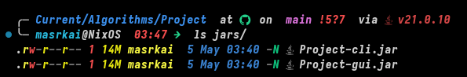

# Daker

Daker is a Java application for managing sports clubs, members, and sports. This project demonstrates fundamental data structures, sorting algorithms, and searching techniques with full Big-O analysis.

---

## Features

- **Club Management**: Create, view, and manage clubs with branches, managers, locations, and member rosters
- **Member Management**: Add, remove, and search members by ID across all clubs
- **Sport Management**: Track sports with team counts
- **Sorting Demonstrations**:
  - Bubble Sort for clubs by name
  - Selection Sort for members by ID
  - Merge Sort for sports by name
- **Binary Search**: Efficient O(log n) search for clubs and members (requires sorted data)
- **Statistics Dashboard**: View system-wide analytics
- **Performance Timing**: Each operation displays execution time in milliseconds

---

## Project Structure

```

ClubSystem/
├── src/
│   ├── ClubSystem.java         # Core data structures (records) and initialization
│   ├── SortingAlgorithms.java  # Bubble, Selection, and Merge Sort implementations
│   ├── BinarySearch.java       # Iterative and recursive binary search
│   ├── Main.java               # Console application entry point and menu system
│   └── GUI/                    # (Optional) JavaFX GUI extension
│       └── ClubSystemGUI.java
├── report.pdf                  # Project report with Big-O analysis
└── README.md                   # This file

```

---

## Data Structures

The system uses Java **records** (Java 21+) for immutable data carriers:

| Record   | Fields                                                                |
|----------|-----------------------------------------------------------------------|
| `Club`   | `name`, `branches` (List\<String\>), `manager`, `location`, `members` |
| `Member` | `id`, `name`, `phone`, `numberOfChildren`                             |
| `Sport`  | `name`, `id`, `numberOfTeams`                                         |

Records provide automatic implementations of `equals()`, `hashCode()`, and `toString()`, making them ideal for data transfer objects.

---

## Algorithms Implemented

### Sorting Algorithms

| Algorithm          | Used For       | Time Complexity | Space Complexity | Characteristics                          |
|--------------------|----------------|-----------------|------------------|------------------------------------------|
| **Bubble Sort**    | Clubs by name  | O(n²)           | O(1)             | Simple, adaptive (stops early if sorted) |
| **Selection Sort** | Members by ID  | O(n²)           | O(1)             | Minimizes swaps (at most n swaps)        |
| **Merge Sort**     | Sports by name | O(n log n)      | O(n)             | Stable, divide-and-conquer, consistent   |

### Searching Algorithms

| Algorithm         | Used For      | Time Complexity | Prerequisite                |
|-------------------|---------------|-----------------|-----------------------------|
| **Binary Search** | Clubs by name | O(log n)        | List must be sorted by name |
| **Binary Search** | Members by ID | O(log n)        | List must be sorted by ID   |

Both iterative and recursive implementations are provided in `BinarySearch.java`.

---

## Big-O Analysis

### Individual Operations

| Operation                       | Time Complexity | Space Complexity |
|---------------------------------|-----------------|------------------|
| Initialize data                 | O(n)            | O(n)             |
| Bubble Sort (clubs)             | O(n²)           | O(1)             |
| Selection Sort (members)        | O(n²)           | O(1)             |
| Merge Sort (sports)             | O(n log n)      | O(n)             |
| Binary Search (club/member)     | O(log n)        | O(1) iterative   |
| Add club/member/sport           | O(1) amortized  | O(1)             |
| Remove member                   | O(m)            | O(m)             |
| Find member by ID (linear scan) | O(c × m)        | O(1)             |
| Display all data                | O(n)            | O(1)             |

> **Note**: `n` = number of elements, `c` = number of clubs, `m` = members per club.

### Overall Program Complexity

The dominant operation is **sorting**. For the overall program:

- **Worst case**: O(n²) when using Bubble Sort or Selection Sort on large datasets
- **Best case**: O(n log n) when Merge Sort is the primary sorting operation
- **Recommendation**: For production use with large datasets, prefer Merge Sort or use Java's built-in `Collections.sort()` (Timsort, O(n log n)).

---

## Prerequisites

- **Java Development Kit (JDK) 21 or later** (required for `record` support)
- Command-line terminal or IDE (IntelliJ IDEA, Eclipse, VS Code)

Verify your Java version:

```bash
java --version
```

Expected output should show Java 21 or higher.

---

## How to Compile and Run

### Using Command Line

1. **Navigate to the project root directory**:

```bash
gradle build
```

2. **Run the application**:

```bash
gradle run     # for the CLI
gradle runGUI  # for the GUI
```

> YOU ARE GOOD TO GO FROM HERE FROM NOW ON THESE ARE EXTRAS

3. **Building the Jars**:

```bash
gradle shadowJar     # for the CLI
gradle shadowJarGUI  # for the GUI
```

4. **The Scripts**

there is a [Folder](Scripts) containing any scripts available, however the one we focus on [expose_jars](Scripts/expose_jars.sh) it just makes a folder that is `jars` and moves the built jars from `build/libs` to the newly created `jars` folder should look something like this



see [gradle build](build.gradle.kts) to verify the build process and dependencies

---

## Usage Guide

When you run the application, you'll see the main menu:

```
==================================================
              MAIN MENU
==================================================
  1. Display All Data (Clubs, Members, Sports)
  2. Sort Clubs by Name (Bubble Sort)
  3. Sort Members by ID (Selection Sort)
  4. Sort Sports by Name (Merge Sort)
  5. Search Club by Name (Binary Search)
  6. Search Member by ID (Binary Search)
  7. Add New Club
  8. Add New Member to Club
  9. Add New Sport
 10. Remove Member from Club
 11. Display Statistics
  0. Exit
==================================================
```

### Example Workflows

**Sort and Search for a Club:**

1. Select option `2` to sort clubs by name (Bubble Sort)
2. Select option `5` to search for a club by name
3. The system automatically sorts before searching (binary search prerequisite)

**Add a Member:**

1. Select option `8`
2. Choose a club from the displayed list
3. Enter member details (ID, name, phone, children count)

**View System Statistics:**

1. Select option `11` to see total counts, averages, and algorithm summaries

---

## Sorting Algorithm Comparison

| Criteria           | Bubble Sort              | Selection Sort   | Merge Sort     |
|--------------------|--------------------------|------------------|----------------|
| **Time (Best)**    | O(n)                     | O(n²)            | O(n log n)     |
| **Time (Average)** | O(n²)                    | O(n²)            | O(n log n)     |
| **Time (Worst)**   | O(n²)                    | O(n²)            | O(n log n)     |
| **Space**          | O(1)                     | O(1)             | O(n)           |
| **Stable?**        | Yes                      | No               | Yes            |
| **Adaptive?**      | Yes                      | No               | No             |
| **Best For**       | Small/nearly sorted data | Minimizing swaps | Large datasets |

### When to Use Each

- **Bubble Sort**: Educational purposes, small datasets, or when data is nearly sorted (adaptive optimization kicks in)
- **Selection Sort**: When memory writes are expensive (guarantees at most n swaps)
- **Merge Sort**: Large datasets, guaranteed O(n log n) performance, stable sorting required

---

## License

The project is licensed under the MIT license, see the license [here](LICENSE)
Note: This project is for educational purposes.
