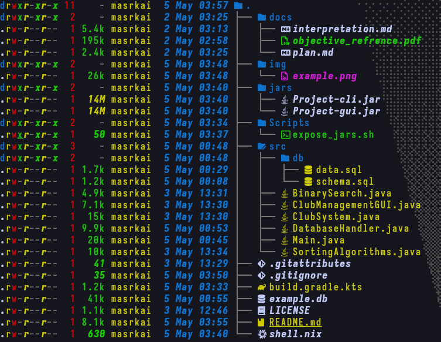

# Daker

Daker is a Java application for managing sports clubs, members, and sports. This project demonstrates fundamental data structures, sorting algorithms, and searching techniques with full Big-O analysis.

---

## Features

- **Club Management** – Create, view, and manage clubs with branches, managers, locations, and member rosters.
- **Member Management** – Add, remove, and search members by ID across all clubs.
- **Sport Management** – Track sports with team counts.
- **Sorting Demonstrations**
  - Bubble Sort for clubs by name
  - Selection Sort for members by ID
  - Merge Sort for sports by name
- **Binary Search** – Efficient O(log n) search for clubs and members (requires sorted data).
- **Statistics Dashboard** – View system‑wide analytics.
- **Performance Timing** – Each operation displays execution time in milliseconds.
- **Graphical Interface** – Optional Swing GUI (`ClubManagementGUI`) for interactive data exploration.
- **Database Persistence** – SQLite backend (`example.db`) with full CRUD operations.

---

## Project Structure



| File                    | Purpose |
|-------------------------|---------|
| `ClubSystem.java`       | Data records (`Club`, `Member`, `Sport`) and utility functions. |
| `SortingAlgorithms.java`| Bubble Sort, Selection Sort, Merge Sort implementations. |
| `BinarySearch.java`     | Iterative & recursive binary search for clubs and members. |
| `Main.java`             | Console-based menu and control flow. |
| `ClubManagementGUI.java`| Swing GUI for sorting/searching tables. |
| `DatabaseHandler.java`  | SQLite Singleton – schema creation, CRUD operations. |

Detailed documentation for each file is available in the [`docs/`](docs/) folder.

---

## Data Structures

The system uses Java **records** (Java 21+) for immutable data carriers:

| Record   | Fields                                                                |
|----------|-----------------------------------------------------------------------|
| `Club`   | `name`, `branches` (List\<String\>), `manager`, `location`, `members` |
| `Member` | `id`, `name`, `phone`, `numberOfChildren`                             |
| `Sport`  | `name`, `id`, `numberOfTeams`                                         |

Records provide automatic implementations of `equals()`, `hashCode()`, and `toString()`, making them ideal for data transfer objects.

---

## Algorithms & Complexity

Detailed analysis can be found in the individual source file docs. Here’s a quick reference:

| Algorithm          | Used for        | Time Complexity | Space Complexity |
|--------------------|-----------------|-----------------|------------------|
| Bubble Sort        | Clubs by name   | O(n²)           | O(1)             |
| Selection Sort     | Members by ID   | O(n²)           | O(1)             |
| Merge Sort         | Sports by name  | O(n log n)      | O(n)             |
| Binary Search      | Club/Member     | O(log n)        | O(1) iterative   |

## Database Schema

The SQLite database contains four tables: `clubs`, `branches`, `members`, `sports`, and a join table `club_sports`. See the full PlantUML diagram in [`docs/DatabaseSchema.md`](docs/DatabaseSchema.md).

---

## Prerequisites

- **Java Development Kit (JDK) 21 or later** (required for `record` support)
- Command-line terminal or IDE (IntelliJ IDEA, Eclipse, VS Code)

Verify your Java version:

```bash
java --version
```

Expected output should show Java 21 or higher.

---

## How to Compile and Run

### Using Command Line

1. **Navigate to the project root directory**:

```bash
gradle build
```

2. **Run the application**:

```bash
gradle run     # for the CLI
gradle runGUI  # for the GUI
```

> YOU ARE GOOD TO GO FROM HERE FROM NOW ON THESE ARE EXTRAS

3. **Building the Jars**:

```bash
gradle shadowJar     # for the CLI
gradle shadowJarGUI  # for the GUI
```

4. **The Scripts**

there is a [Folder](Scripts) containing any scripts available, however the one we focus on [expose_jars](Scripts/expose_jars.sh) it just makes a folder that is `jars` and moves the built jars from `build/libs` to the newly created `jars` folder should look something like this


see [gradle build](build.gradle.kts) to verify the build process and dependencies

---

## Usage Guide

When you run the application, you'll see the main menu:

```
==================================================
              MAIN MENU
==================================================
  1. Display All Data (Clubs, Members, Sports)
  2. Sort Clubs by Name (Bubble Sort)
  3. Sort Members by ID (Selection Sort)
  4. Sort Sports by Name (Merge Sort)
  5. Search Club by Name (Binary Search)
  6. Search Member by ID (Binary Search)
  7. Add New Club
  8. Add New Member to Club
  9. Add New Sport
 10. Remove Member from Club
 11. Display Statistics
  0. Exit
==================================================
```

### Example Workflows

**Sort and Search for a Club:**

1. Select option `2` to sort clubs by name (Bubble Sort)
2. Select option `5` to search for a club by name
3. The system automatically sorts before searching (binary search prerequisite)

**Add a Member:**

1. Select option `8`
2. Choose a club from the displayed list
3. Enter member details (ID, name, phone, children count)

**View System Statistics:**

1. Select option `11` to see total counts, averages, and algorithm summaries

---

## License

The project is licensed under the MIT license, see the license [here](LICENSE)
Note: This project is for educational purposes.
