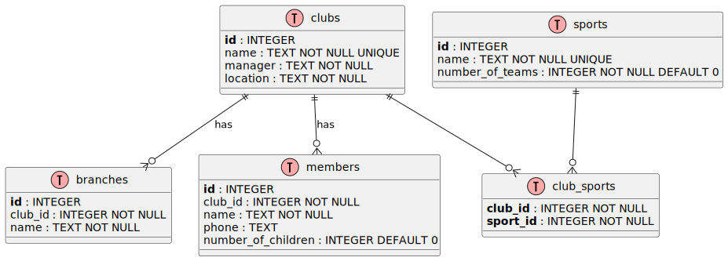

# Database Schema

The SQLite database `example.db` contains four core tables plus an association table.

## PlantUML Diagram

## Table Descriptions

### clubs

- `id` – Auto‑increment primary key.
- `name` – Unique club name (e.g., "Lions").
- `manager`, `location` – Text fields.

### branches

- Linked to `clubs` via `club_id` (foreign key with CASCADE delete).
- Multiple branches per club.

### members

- `id` is a user‑provided primary key (not auto‑incremented).
- `club_id` foreign key to clubs.
- `number_of_children` defaults to 0.

### sports

- `id` is user‑provided.
- `name` unique.
- `number_of_teams` integer.

### club_sports

- Many‑to‑many relationship between clubs and sports.
- Composite primary key (`club_id`, `sport_id`).
- No extra attributes.

## SQL Files

- **`schema.sql`**: Contains `CREATE TABLE IF NOT EXISTS` statements for all tables.
- **`data.sql`**: Inserts sample clubs, branches, members, sports, and club‑sport associations.

\newpage